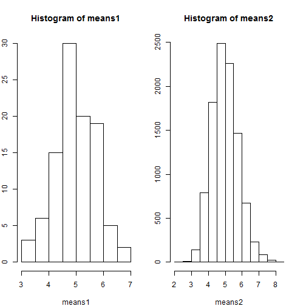

###SYNOPSIS
The aim of this study is to use simulation to explore inference and do some simple inferential data analysis. 
This assignment has two parts-

1.Simulation exercises.

2.Basic inferential data analysis.

The exponential distribution can be simulated in R with rexp(n, lambda) where lambda is the rate parameter. The mean of exponential distribution is 1/lambda and the standard deviation is also also 1/lambda.

Here lambda is set as =0.2

 In this simulation, we will investigate the distribution of averages of 40 exponential(0.2)s. 

In simulation, we will calculate the means of 40 random values from exponential distribution with rate parameter lambda equal to 0.2. We will do 100 and 10,000 simulations and compare their distribtuions.

####1. Show where the distribution is centered at and compare it to the theoretical center of the distribution.


```r
set.seed(123)

means1 <- c()
for(i in 1:100){
  m <- mean(rexp(40, 0.2))
  means1 <- append(means1,m);
}

means2 <- c()
for(i in 1:10000){
  m <- mean(rexp(40, 0.2))
  means2 <- append(means2,m);
}
```

We plot histograms of the mean to check the central tendency


```r
par(mfrow=c(1,2), mar=c(4,2,4,2)) 
hist(means1)
hist(means2)
```

 


As we can see- increasing the number of simulations will improve the central tendency and the distribution gets closer to a standard normal distribution.

####Center of Distribution

As given in the assignment the Theoretical Distribution mean and SD is 1/lambda which is 5.

We calculate the center of distribution for the simulated example


```r
mean(means1)
```

```
## [1] 5
```

```r
mean(means2)
```

```
## [1] 4.995
```

As we can see from the outputs above- each of these is close to 5.

Also as we increase the number of simulations the value comes closer to the theoretical value.

####2. Show how variable it is and compare it to the theoretical variance of the distribution.

For the next part we use the standard functions sd and var in r


```r
var(means2)
```

```
## [1] 0.6127
```

```r
sd(means2)
```

```
## [1] 0.7827
```

Theoretical standard deviation of exponential distribution is 1/lambda, while our calculated SD is 0.79


####3. Show that the distribution is approximately normal.

We know that increasing the number of simulations will give a distribution which is closer to the standard normal.

In order to prove that distribution is normal mathematically, we will use the following properties of the normal distribution:

1.  68% of distribution lies between center and +/- 1 SD

2.	95% of distribution lies between center and +/- 2SD

3.	97.5% of distribution lies between center and +/- 3SD


```r
center <- mean(means2) 
sdev <- sd(means2) 
x <- means2[means2 >= (center - sdev) & means2 <= (center + sdev)]
y <- means2[means2 >= (center - 2 * sdev) & means2 <= (center + 2 * sdev)]
z <- means2[means2 >= (center - 3 * sdev) & means2 <= (center + 3 * sdev)]
round(length(x)/length(means2),2) 
```

```
## [1] 0.68
```

```r
round(length(y)/length(means2),2)
```

```
## [1] 0.96
```

```r
round(length(z)/length(means2),2)
```

```
## [1] 1
```
These correspond to the theoretical values above

####4. Evaluate the coverage of the confidence interval for 1/lambda


```r
error <- qt(0.975,df=length(means2)-1)*sdev/sqrt(length(means2))
lower <- center - error
upper <- center + error
lower
```

```
## [1] 4.98
```

```r
upper
```

```
## [1] 5.011
```

Thus the calculated confidence intervals are (4.98, 5.011)

Thank you for reading

-----Have a great day-----
