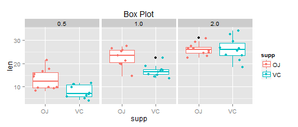

###SYNOPSIS
The aim of this study is to analyse the tooth growth data in the R data sets package as a part of statistical inference class in the data science track.

Description of data set-The response is the length of odontoblasts (teeth) in each of 10 guinea pigs at each of three dose levels of Vitamin C (0.5, 1, and 2 mg) with each of two delivery methods (orange juice or ascorbic acid).

####1. Load the ToothGrowth data and perform some basic exploratory data analyses 


```r
library(ggplot2)
library(plyr)
library(xtable)
library(grid)

data(ToothGrowth)
head(ToothGrowth)
```

```
##    len supp dose
## 1  4.2   VC  0.5
## 2 11.5   VC  0.5
## 3  7.3   VC  0.5
## 4  5.8   VC  0.5
## 5  6.4   VC  0.5
## 6 10.0   VC  0.5
```

```r
ggplot(ToothGrowth, aes(x=dose, y=len,col=supp)) + 
  geom_point() + 
  facet_wrap(~ supp) + 
  stat_smooth(method='lm') +
  ggtitle('Scatter Plot')
```

 

```r
ggplot(ToothGrowth, aes(supp, len,col=supp)) + 
  geom_boxplot() + geom_jitter()+
  facet_wrap(~ dose) + 
  ggtitle('Box Plot');
```

 

####Provide a basic summary of the data.

```r
a <-ToothGrowth
summary(ToothGrowth)
```

```
##       len       supp         dose     
##  Min.   : 4.2   OJ:30   Min.   :0.50  
##  1st Qu.:13.1   VC:30   1st Qu.:0.50  
##  Median :19.2           Median :1.00  
##  Mean   :18.8           Mean   :1.17  
##  3rd Qu.:25.3           3rd Qu.:2.00  
##  Max.   :33.9           Max.   :2.00
```

```r
str(ToothGrowth)
```

```
## 'data.frame':	60 obs. of  3 variables:
##  $ len : num  4.2 11.5 7.3 5.8 6.4 10 11.2 11.2 5.2 7 ...
##  $ supp: Factor w/ 2 levels "OJ","VC": 2 2 2 2 2 2 2 2 2 2 ...
##  $ dose: num  0.5 0.5 0.5 0.5 0.5 0.5 0.5 0.5 0.5 0.5 ...
```


```r
mean <-tapply(a$len,a$supp,mean,simplify=F)
mean[1]
```

```
## $OJ
## [1] 20.66
```

```r
sd <-tapply(a$len,a$supp,sd,simplify=F)
```

We assume that the data is roughly mound-shaped (as can be seen in the plot below).  The data must also be IID (independant and identically distributed), which is reasonable because scientific invesitagations like this one usually select subjects randomly from a given population for each test group.  Since the sample size is small, t-tests will be used.

 

```r
Dose <- as.factor(ToothGrowth$dose);
ggplot(ToothGrowth, aes(len)) + geom_density(aes(fill=Dose), alpha=.2) + facet_wrap(~ supp)
```

 
 
### Results
First, we compare the ascorbic acid supplement to the orange juice (for all dose levels) using a two-sample t-test.
 

```r
temp <- t.test(subset(ToothGrowth, supp=='OJ',len),subset(ToothGrowth, supp=='VC',len) )[c('p.value','conf.int')];
bySupp <- data.frame(Lower = temp$conf.int[1], Upper=temp$conf.int[2],P.Value= temp$p.value);
print(xtable(bySupp,cap="T-Test of Orange Juice vs. Ascorbic Acid"),comment=F);
```

```
## \begin{table}[ht]
## \centering
## \begin{tabular}{rrrr}
##   \hline
##  & Lower & Upper & P.Value \\ 
##   \hline
## 1 & -0.17 & 7.57 & 0.06 \\ 
##    \hline
## \end{tabular}
## \caption{T-Test of Orange Juice vs. Ascorbic Acid} 
## \end{table}
```

The confidence interval incldues 0, and the p-value is greater than 5%, so there is no significant difference between orange juice and ascorbic acid on tooth growth when all dose levels are included.  Now we will use a more "fine-grained" approach and perform t-tests to compare the supplements by dosage.


```r
byDoseSupp <- ddply(ToothGrowth, c('dose'), function(x) {
  VC <- subset(x, supp=='VC',len);
  OJ <- subset(x,supp=='OJ',len);
  res <- t.test(OJ, VC); 
  return(c( res$conf.int, res$p.value));
});
colnames(byDoseSupp) <- c('Dose', 'Lower', 'Upper', 'P.Value');
print(xtable(byDoseSupp, cap="T-Test of OrangeJuice vs. Ascorbic Acid by Dose"), comment=F);
```

```
## \begin{table}[ht]
## \centering
## \begin{tabular}{rrrrr}
##   \hline
##  & Dose & Lower & Upper & P.Value \\ 
##   \hline
## 1 & 0.50 & 1.72 & 8.78 & 0.01 \\ 
##   2 & 1.00 & 2.80 & 9.06 & 0.00 \\ 
##   3 & 2.00 & -3.80 & 3.64 & 0.96 \\ 
##    \hline
## \end{tabular}
## \caption{T-Test of OrangeJuice vs. Ascorbic Acid by Dose} 
## \end{table}
```

Here, we have significant findings.  At the .5mL and 1.0mL dose levels, Orange Juice has a demonstrable increase in tooth growth compared to the same dose of ascorbic acid.  At the 2.0mL dose, there is no significant difference.

Thank you for reading

-----Have a great day-----
